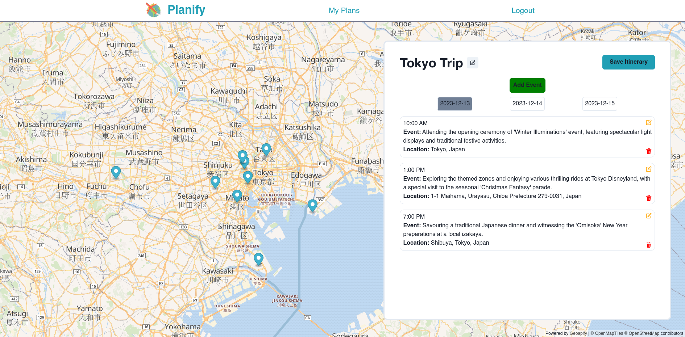

# Planify

Planify is a React-based web application that helps users plan their trips by generating a detailed itinerary based on user inputs such as destinations, dates, budget, and activities.



## Table of Contents

- [Features](#features)
- [Installation](#installation)
- [Running the Application](#running-the-application)

## Features

- **Destination Planning**: Users can input multiple destinations with optional visiting dates.
- **Customizable Itinerary**: The itinerary is generated based on user preferences for activities, budget, and trip duration.
- **Interactable Map**: A map is created with markers of the events. Each event in the itinerary can be clicked to zoom to its corresponding marker in the map.
- **Savability and Flexibility**: Each itinerary can be saved and edited after created. 

## Installation

### Prerequisites

- Node.js and npm
- An API key for OpenAI's GPT-3.5 (You can get one by signing up on [OpenAI's website](https://beta.openai.com/signup/))

### Steps

1. Clone the repository:

    ```bash
    git clone https://github.com/yourusername/planify.git
    cd Planify
    ```

2. Install dependencies for the frontend

    ```bash
    cd frontend
    npm install
    ```

3. Install dependencies for the backend

    ```bash
    cd backend
    npm install
    ```

4. Planify requires an OpenAI API key to function. Create a .env.local file in the root of your project with the following content:

    ```plaintext
    VITE_CHATGPT_API_KEY=your-openai-api-key-here
    ```
    Replace your-openai-api-key-here with your actual API key from OpenAI.

## Running the Application

### Development Mode

To start the application in development mode, run:

```bash
npm run dev
```

This will start the app on http://localhost:5173.

